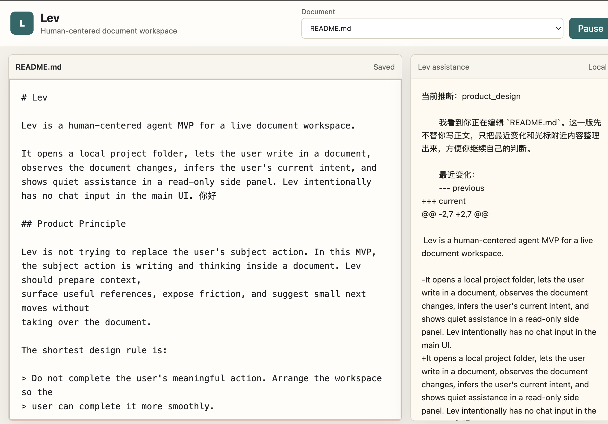

# Lev

Lev is a human-centered agent MVP for a live document workspace.

It opens a local project folder, lets the user write in a document, observes the document changes, infers the user's current intent, and shows quiet assistance in a read-only side panel. Lev intentionally has no chat input in the main UI.

## Product Demo

Lev keeps the user's main action in the document editor and surfaces quiet,
read-only assistance beside it.



## Product Principle

Lev is not trying to replace the user's subject action. In this MVP, the subject action is writing and thinking inside a document. Lev should prepare context,
surface useful references, expose friction, and suggest small next moves without
taking over the document. 


The shortest design rule is:

> Do not complete the user's meaningful action. Arrange the workspace so the
> user can complete it more smoothly.

## What The MVP Does

- Opens a folder as a Lev workspace.
- Lists `.md` and `.txt` documents in that workspace.
- Provides a two-pane workbench:
  - left: editable document
  - right: read-only Lev assistance
- Autosaves the active document.
- Sends document diffs, cursor position, and selection offsets to the agent.
- Reuses the existing agent loop and search/page-reading tools.
- Falls back to local diff/cursor-context assistance if the model or API key is
  unavailable.

## Project Structure

```text
client.py                 AI Builders Space client
tools.py                  web_search and read_page tools
main.py                   original one-shot agent loop CLI

lev/
  assist.py               document-change -> prompt -> assistance
  models.py               dataclass request/response models
  server.py               no-dependency local HTTP server
  workspace.py            local document listing/read/write

web/
  index.html              Lev workbench shell
  app.js                  autosave, cursor tracking, assistance requests
  styles.css              two-pane UI

docs/
  lev-mvp.md              MVP behavior and evaluation
  editor-decision.md      editor/fork decision
```

## Setup

```bash
uv sync
```

Create `.env` in this folder:

```text
BUILDER_API_KEY=your_api_key_here
```

`client.py` reads this local `.env` file.

## Run Lev

Open the current repository as the workspace:

```bash
uv run python -m lev.server .
```

Then open:

```text
http://127.0.0.1:8787
```

Open another folder as the workspace:

```bash
uv run python -m lev.server /path/to/project
```

Change the port if needed:

```bash
uv run python -m lev.server . --port 8790
```

## Keep The Original Agent Loop

The original one-shot CLI still works:

```bash
uv run python main.py "Search for the latest Python release."
```

Lev uses that loop as a lower-level capability. The new HC layer changes the
entrypoint from "user prompt" to "human activity inside a document".

## Editor Direction

The MVP uses a native `<textarea>` behind a small frontend boundary. This keeps
the first version dependency-free and easy to run.

For the next step, use CodeMirror 6 rather than forking a full editor product.
CodeMirror is much lighter than Monaco, has first-class document state,
selection, cursor, transactions, decorations, and programmatic scrolling, and
fits Lev's document-workbench shape. Monaco is excellent for code-IDE behavior
but is a heavier starting point for this writing/research MVP.

See [docs/editor-decision.md](docs/editor-decision.md).
