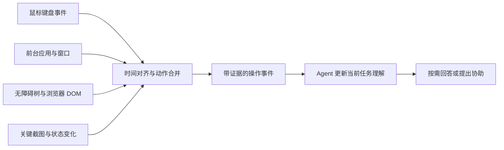

# Computer Use 原理与人类操作事件流调研

记录日期：2026-09-26

本文汇集两轮讨论：computer use 的工作原理与人类操作事件流的可行性，以及不依赖截图和录屏的方案。内容基于官方技术文档、开源项目和据此提出的设计判断；没有在本机启动录制或进行实现验证。

## 第一轮：Computer Use 的原理，以及能否反向采集人类轨迹

**能，而且这条反向链路已经有实际实现。我的判断是：把人类操作变成 agent 可读的事件流，技术上很可行；真正决定它是否有用的，是能否把操作与当时的对象、界面变化和任务上下文对齐。**

Computer use 和反向观察过程，可以放在同一张图里理解：

```text
Agent 操作电脑：
目标 + 当前界面 → 决定动作 → 执行动作 → 观察结果 → 决定下一步

Agent 观察人类：
当前界面 + 人类动作 + 后续变化 → 重建操作过程 → 更新任务理解
```

它们共用大量底层能力，但存在一个关键的不对称：**前者通常已经知道目标，后者需要从行为中推断目标。**

### 1. Computer Use 是怎么工作的

以“在网页里搜索一篇论文”为例，一个典型的 computer-use agent 会经历五步：

1. **观察。** 获取截图，或获取 DOM、无障碍树等结构化信息。
2. **理解与规划。** 判断当前在哪个页面、搜索框在哪里、下一步应该做什么。
3. **定位。** 将“搜索框”对应到屏幕坐标或可操作的元素。这一步通常叫 *grounding*。
4. **执行。** 输出点击、输入、滚动等动作，由外部程序实际执行。
5. **验证。** 再次观察界面，检查搜索词是否输入成功、结果是否出现，然后继续。

**模型负责选择动作，运行程序负责把动作施加到电脑上。** OpenAI 的文档提供两种接法：模型返回结构化动作，或者生成调用 Playwright / PyAutoGUI 等库的代码；Anthropic 也明确把它描述为“模型请求动作—应用执行—返回结果”的循环。[OpenAI Computer use](https://developers.openai.com/api/docs/guides/tools-computer-use)、[Anthropic Computer use tool](https://platform.claude.com/docs/en/agents-and-tools/tool-use/computer-use-tool)

例如，模型可能输出：

```json
{"type": "click", "x": 405, "y": 157}
```

这个 JSON 本身不会点击任何东西。执行器将它转换为浏览器或操作系统输入，随后返回新截图。即使点击调用成功，也还要检查界面是否发生了预期变化。

Computer use 的观察方式主要有三类：

| 观察方式 | Agent 实际拿到什么 | 优势 | 主要缺口 |
|---|---|---|---|
| 截图 | 屏幕像素 | 能覆盖各种可见界面，包括图表、画布 | 要从像素识别文字、对象和坐标 |
| DOM / 无障碍树 | 按钮、文本框、名称、值、层级等 | 对象身份和状态更明确 | 依赖应用暴露的信息，覆盖不完整 |
| 混合观察 | 结构化信息与截图 | 结构描述对象，截图补充视觉证据 | 需要对齐两种信息的时间与位置 |

无障碍树可以理解为应用向外提供的一份“界面对象目录”。屏幕上看见一个按钮，树中可能对应：

```text
role: button
name: Search
bounds: [380, 140, 90, 36]
enabled: true
```

Windows UI Automation 就提供这类对象、属性与事件接口；macOS 有对应的 Accessibility API。[Microsoft UI Automation](https://learn.microsoft.com/en-us/windows/win32/winauto/entry-uiautocore-overview)、[Apple AXObserver](https://developer.apple.com/documentation/applicationservices/1460133-axobservercreate)

### 2. 反向采集已经有哪些实现证据

反向过程的第一步并不需要让模型“看视频猜人点击了哪里”。**人类的鼠标、键盘输入原本就会经过操作系统和浏览器的事件系统，可以在授权后直接采集。** 然后再用界面结构与截图解释这些动作。

| 项目 / 系统 | 已公开的机制 | 对这一问题意味着什么 |
|---|---|---|
| **OpenCUA / AgentNetTool** | 同步录制屏幕、鼠标键盘事件和无障碍树；将低层事件合并，再匹配动作前的画面 | 人类示范可以转换为供模型使用的状态—动作轨迹 |
| **OpenAdapt Capture** | 将桌面输入与屏幕记录放在共同时间线上，并可保留原生无障碍观察 | 可以参考现成桌面采集层 |
| **rrweb** | 把网页 DOM、输入、滚动、鼠标等变化记录成 JSON 事件流 | 网页轨迹可以直接结构化，无须先录成视频 |
| **ChatGPT Computer History** | 官方文档描述从允许的应用和网站采集交互事件与 macOS 无障碍上下文，再生成摘要与记忆 | “人类活动 → 事件流 → agent 上下文”已经有产品形态 |

来源：[OpenCUA](https://github.com/xlang-ai/OpenCUA)、[OpenAdapt Capture](https://github.com/OpenAdaptAI/openadapt-capture)、[rrweb 文档](https://rrweb.com/docs/)、[Computer History 官方文档](https://learn.chatgpt.com/docs/customization/computer-history)。这些是项目和官方披露的能力，本次没有逐项实测；Computer History 的具体可用性也需要看账户和设置。

OpenCUA 有一个很值得借鉴的细节：它先做 **Action Reduction**，把密集的移动、按键合并为点击、文本输入、快捷键等动作；再做 **State–Action Matching**，把动作和动作开始前的画面对齐。训练时如果错误地用动作后的画面预测该动作，就会泄漏未来信息。[OpenCUA 数据处理说明](https://github.com/xlang-ai/OpenCUA)

### 3. “Agent 可读”需要分成三个层次

| 层次 | 示例 | 如何产生 |
|---|---|---|
| **原始事件** | 10:03:21，在 `(812, 436)` 松开鼠标左键 | 操作系统或浏览器直接记录 |
| **有对象和结果的操作** | 点击论文页面上的 Download 按钮；随后出现下载完成记录 | 输入事件 + 元素信息 + 后续状态对齐 |
| **任务理解** | 用户可能在收集与某个研究问题相关的论文 | 模型结合前后文推断 |

第一层容易被程序解析，却不足以帮助 agent 理解工作。第三层有价值，但可能猜错。**第二层是最应该先做扎实的部分：在什么地方，对什么对象，做了什么，随后观察到了什么。**

拿一个具体例子：打开论文页面，选中一段文字，复制，再切换到笔记应用粘贴。

如果只记录按键，agent 得到的是：

```text
mouse_drag → Cmd+C → app_switch → Cmd+V
```

它知道发生了复制粘贴，但不知道复制的对象和目的。

如果记录相应的语义上下文，agent 可以得到：

```text
1. 浏览器打开论文 A，记录 URL 和页面标题。
2. 用户选中了段落 P，记录可获取的选中文本及来源。
3. 用户执行复制快捷键。
4. 前台应用切换到笔记，当前文档是 B。
5. 文档 B 出现了与段落 P 匹配的新增文本。
```

此时可以较有把握地重建“从论文 A 向笔记 B 摘录了一段文字”。至于“这段话支持用户的研究假设”，则仍然是需要更多上下文的推断。

**时间相邻也不自动等于因果成立。** 用户点击一个按钮后页面恰好刷新，不能仅凭时间顺序就声称按钮触发了刷新。事件结构应该保留观察证据，让后续推断可以被检查和修正。

### 4. macOS 上的采集架构

下面是包含视觉补充的设计。截图是可选的信息源，其必要性在第二轮讨论中进一步说明。



各个采集源的职责：

- **输入事件：** 用 `CGEventTap` 或 `NSEvent` 监测点击、键盘、滚动等。Apple 提供被动监听方式；`NSEvent` 的全局监听覆盖其他应用，自己的应用需要本地监听补齐。[CGEventTap](https://developer.apple.com/documentation/coregraphics/cgevent/tapcreate%28tap%3Aplace%3Aoptions%3Aeventsofinterest%3Acallback%3Auserinfo%3A%29)、[Monitoring Events](https://developer.apple.com/library/archive/documentation/Cocoa/Conceptual/EventOverview/MonitoringEvents/MonitoringEvents.html)
- **界面对象与变化：** 用 Accessibility 查询控件，并通过 `AXObserver` 订阅应用支持的通知。它提供的是应用暴露的观察，不能假定每个应用都完整支持。[AXObserver](https://developer.apple.com/documentation/applicationservices/1460133-axobservercreate)
- **视觉证据：** 用 ScreenCaptureKit 获取选定屏幕或窗口的画面，补充结构化接口看不到的内容。[ScreenCaptureKit](https://developer.apple.com/documentation/screencapturekit)
- **网页细节：** 在获得相应站点权限的浏览器采集层中记录 URL、元素、选区和 DOM 变化；rrweb 可以作为网页记录层的参考。[rrweb 事件模型](https://rrweb.com/docs/events)

设计建议是：**持续采集轻量事件，按重要变化补充上下文，再按需调用模型。** 连续鼠标移动不值得每次唤醒大模型；一次页面跳转、一次编辑结束、一次文件导出，通常更有信息量。不过也要观察没有输入动作时的变化，例如下载完成、后台任务报错，不能只盯住用户点击。

### 5. 事件格式示例

以下是建议格式，不是现有标准或实测记录：

```json
{
  "event_id": "e1042",
  "session_id": "s12",
  "sequence": 1042,
  "time_ms": 185230,
  "kind": "ui.action",
  "app": "browser",
  "window_id": "w7",
  "page_url": "https://example.org/paper/123",
  "action": {
    "type": "click"
  },
  "target": {
    "role": "button",
    "name": "Download PDF",
    "source": "dom"
  },
  "evidence": {
    "before": "snapshot_1041",
    "after": "snapshot_1043",
    "related_events": ["e1043"]
  }
}
```

下载完成应当有自己的观察事件；“用户正在做文献调研”应当放进单独的任务假设，并引用支持它的事件。这样，当后续发现用户只是帮别人下载附件时，agent 可以修正理解，而不会污染底层记录。

### 6. 影响实用性的三个设计点

**第一，保留对象身份和原始来源。** 事件里最好有 URL、文档标识、文件路径或可重新定位的对象信息。这样 agent 后续能读取原文、检查现状。只留下“用户编辑了一份报告”的自然语言摘要，很快就会丢掉可操作性。

**第二，把“已显示、已操作、已完成”分开。** 页面在前台停留了两分钟，只能证明它显示过；点击保存，只能证明发起过操作；看到保存完成提示，才多了一层结果证据。这种区分直接决定 agent 会不会误判进度。

**第三，捕获阶段就设置记录边界。** 对持续采集系统，建议从用户选定的应用开始，敏感字段不保留原文，并提供暂停与删除入口。采集权限、是否上传模型、是否允许 agent 执行动作，应当是不同的控制项；屏幕上出现的文字也应作为被观察的数据，不能自动获得指令权限。

### 7. 第一轮验证应该做什么

针对持续观察、能形成主动协助的产品方向，建议是：**先验证“agent 能否接上人正在进行的工作”，再扩展到主动行动。** 这一产品方向沿用了此前讨论的上下文；具体技术依据是本次重新查到的资料。

一个有判别力的首轮实验是：让人真实完成一段“搜索资料 → 阅读 → 摘录 → 编辑”的跨应用工作，只给 agent 事件流，让它回答：

- 当前正在处理什么，证据来自哪里？
- 哪些操作已经完成，哪些结果还没确认？
- 当前文档和参考来源在哪里？
- 如果现在继续工作，应该先检查什么？

用实际操作记录核对这些回答，就能判断事件流是否保存了足够的上下文。之后再接主动协助：发现有价值的变化时更新任务理解，判断是否值得打断用户，并在执行前重新检查当前状态。

**最小交付物可以定为“一段跨应用真实轨迹、可检查的事件记录，以及 agent 基于这些记录恢复任务上下文的结果”。** 这能直接检验核心设想，比先做全天录屏和自动日报更能说明事件流是否真的支持协作。

## 第二轮：关键截图是否必须，能否完全不依赖截图和录屏

**关键截图不是必须的。完全可以做一套不依赖截图和录屏的方案；对于“把人的操作变成 agent 可理解的工作上下文”，建议优先采用结构化事件与文本。** 它的主要限制是：对应用没有暴露出来的视觉内容，理解能力会明显下降，例如画布中的图形关系。

第一轮把关键截图放进架构，是作为补充证据的设计选择，不是技术上的必要条件。

而且有直接的产品依据：**Computer History** 官方文档描述了“交互事件 + macOS 无障碍上下文 → 摘要与记忆”的方案，明确说不需要 Screen Recording 权限，历史中也不包含截图。[Computer History 官方说明](https://learn.chatgpt.com/docs/customization/computer-history)

### 1. 无截图方案的信息来源

可以将无截图方案理解为：**直接读取软件已经知道的对象和变化，把它们组织成事件流。**

| 信息来源 | 能获得什么 | 对 agent 的价值 |
|---|---|---|
| 操作系统的应用、窗口和焦点信息 | 当前应用、窗口标题、前台切换、焦点变化 | 知道用户在哪个工作环境 |
| 鼠标键盘事件 | 点击、滚动、快捷键等 | 知道发生了什么输入动作 |
| Accessibility 无障碍接口 | 控件角色、名称、值、选中文本等，取决于应用支持 | 知道用户操作的对象 |
| 浏览器扩展中的 DOM 与网页事件 | URL、页面标题、点击对象、输入和选区变化、DOM 更新 | 理解网页内的具体操作 |
| 应用插件或专用接口 | 文档标识、编辑差异、保存状态、终端命令等，取决于接口 | 获得更准确的工作语义和结果 |

macOS 的 `AXObserver` 可以接收指定应用的无障碍通知；网页端 rrweb 则展示了用 DOM 快照与增量事件重建活动的机制。这里的 **DOM 快照是结构化页面状态，不是屏幕图片**。[Apple AXObserver](https://developer.apple.com/documentation/applicationservices/1460133-axobservercreate)、[rrweb 事件模型](https://rrweb.com/docs/events)

### 2. 不包含图片的事件流示例

例如，在网页上读论文，然后摘录到笔记。一个没有任何图片的事件流，可以是：

```text
10:03:01  page.activated
          url: ...
          title: "论文 A"

10:03:18  text.selection_changed
          text: "被选中的段落……"
          source: 论文 A 的 URL

10:03:20  input.shortcut
          keys: Cmd+C

10:03:23  document.activated
          document: "研究笔记 B"

10:03:25  document.text_changed
          inserted_text: "被选中的段落……"
          location: 第二节
```

这是一个**设计示例**：浏览器端可以通过扩展获得页面和选区信息；笔记端的文档身份、具体插入位置和文本变化，需要该应用的无障碍能力或插件接口支持。拿不到的字段就留空。

有这些数据，agent 已经可以理解“用户从论文 A 摘录到笔记 B”，并找到原始来源。对这种工作，文本和文档标识通常比截图更直接。

### 3. 操作事件与状态观察缺一不可

**真正需要解决的，是“操作事件”与“状态观察”两种信息都要有。**

只有 `Cmd+C → Cmd+V`，信息太少；加入复制对象、目标文档和内容变化，才形成有意义的工作记录。因此，无截图架构可以是：

```text
操作事件 ───────────────┐
                       ↓
应用 / 页面 / 文档状态 → 时间对齐 → 有对象的操作记录 → Agent 上下文
                       ↑
状态变化与结果通知 ──────┘
```

系统还应该在开始观察或切换应用时读取一次当前结构化状态，之后记录增量变化。否则，采集开始前就已经打开的文档、已经存在的内容，会缺少上下文。

### 4. 覆盖范围与边界

- **网页、文本编辑、表单、列表等工作：** 当 DOM 或无障碍信息完整时，可以较好地支持。
- **图形、图表、设计画布：** 如果应用提供对象树和插件接口，仍然可以不截图；例如读取图形位置、尺寸和连接关系。没有这些接口时，就会丢失视觉语义。
- **远程桌面或只暴露像素的界面：** 本地接口可能只能看到“一个远程窗口”，无法知道里面具体操作了什么。纯结构化方案在这里存在实质盲区。

因此，**不截图的代价是覆盖范围取决于应用暴露的结构，而不是整个方案不可行。** 同时，无截图也不等于没有敏感数据：选中文本、输入内容和文档正文仍然需要明确的采集范围。

### 5. 推荐的第一版技术路线

选择 **“macOS 无障碍接口 + 浏览器扩展 + 少量关键应用适配”** 作为第一版技术路线。先用这套结构化事件流验证 agent 能否理解浏览、阅读、摘录和编辑的连续过程。如果某个重要场景确实因为缺少视觉信息而失败，再针对那个场景决定要补应用接口，还是引入截图。
