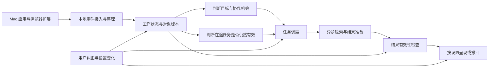

# 全双工架构是否适合 Lev

研究日期：2026-09-29。状态：基于一手资料的架构建议，尚未由用户确认为架构决策。本文没有实现采集器、运行模型或测量 Lev 性能。

## 结论

**适合采用“持续观察、并行工作、按新证据调整输出”的运行方式。第一版建议用事件驱动的并发运行时实现，并保留接入原生交互模型的接口。** Lev 的关键要求是：准备一份结果时仍能跟随用户工作，目标变化后能停止过时任务，呈现前能确认结果仍然适用。

“全双工”有三个层次，必须分别判断：

| 层次 | 解决的问题 | 对 Lev 的意义 |
| --- | --- | --- |
| 双向传输 | 两端都可以主动发送消息 | 可以传递观察、进度与取消信号；不能单凭连接形式获得意图理解 |
| 原生交互模型 | 模型持续接收输入，同时产生输出 | 适合紧密的语音、多模态交互；是否适合结构化桌面事件，仍要用目标任务验证 |
| 应用并发运行时 | 观察、理解、后台任务、呈现拥有独立生命周期 | Lev 第一版需要的核心能力，可先用普通模型调用与异步任务构建 |

第三层不要求单次模型生成能够中途接收新输入：普通请求型模型在一次调用中依据启动时提交的上下文快照推理。应用继续收集事件，不代表新事件已经进入正在运行的推理；必要时取消旧调用、发起新调用，或在下一步工具操作前重新取上下文。具体 API 是否允许更新正在生成的请求，需要独立核查，不能从 WebSocket 或流式输出推导出来。

**推荐失效的条件：** 如果实际验证表明，普通模型的分段判断持续错过秒级机会，或者取消重算成本高到无法接受，而可用的原生交互模型能在同一批结构化事件上明显改善这些指标，就应调整模型层。若失败源于没有采到关键内容，全双工本身不能补齐信息。

## 一手证据与可迁移机制

以下八项是本研究实际采用的来源。文献中的指标、产品研究展示和官方接口能力，均不视为 Lev 的实测结果。

1. **双向连接的范围。** RFC 6455 说明 WebSocket 握手后双方可独立发送消息。它定义的是通信协议，没有规定何时帮助用户、如何更新推理或取消后台工作。[RFC 6455 §1.2](https://datatracker.ietf.org/doc/html/rfc6455#section-1.2)

2. **原生语音全双工。** Moshi 将用户与助手语音建模为并行流，支持重叠与打断。该论文讨论语音对话；其语音延迟不能直接用于估计桌面意图识别或复杂结果生成的延迟。[Moshi，2024](https://arxiv.org/abs/2410.00037)

3. **持续交互与后台推理分开。** Thinking Machines 的研究预览使用时间对齐的微轮次，以及异步后台模型；交互模型持续接收输入，后台承担较长推理和工具工作。这为分离快慢过程提供了直接参考，但属于专门训练的模型路线，不能当作普通 LLM 的现成特性。[Interaction Models，2026-05-11](https://thinkingmachines.ai/blog/interaction-models/)

4. **任务级取消与去重。** LiveKit 的异步工具允许后台工作、进度更新、按调用 ID 取消和配置重复调用策略。其文档中重复判断按工具名进行；Lev 应借鉴生命周期管理，另按具体工作对象与目标定义任务身份。[LiveKit Async tools](https://docs.livekit.io/agents/logic/tools/async/)

5. **控制信号优先于普通结果。** Pipecat 将系统帧放入高优先级处理通道，与普通数据和控制帧的有序通道区分。Lev 可借鉴这种方式，保证暂停、失效和取消信号不会排在长结果后面。[Pipecat Pipeline & Frame Processing](https://docs.pipecat.ai/pipecat/learn/pipeline)

6. **取消并非强制停止。** Swift 官方说明任务取消是协作式的；不检查取消状态的函数仍可能完成。因此，Lev 发出取消后还要防止迟到结果重新进入当前协作区。[Swift Task.cancel()](https://docs.swift.org/latest/documentation/swift/task/cancel%28%29/)

7. **主动性应独立评估。** 2026 年 9 月的一篇预印本在英文独白触发实验中发现，被点名与停顿比错误事实或危险内容更容易触发所测全双工模型发言。这有限地支持“支持同时听说不等于会判断何时介入”；实验不是桌面工作评测。[Full-Duplex Speech Models Take the Floor When Asked, Not When Needed](https://arxiv.org/abs/2609.19596)

8. **协助时机与内容分开。** ProAgentBench 将主动协助分为时机预测和内容生成，使用真实工作中的截图与应用元数据。它可参考评估问题的拆分，但其截图输入和离线实验不能证明 Lev 的结构化采集充分，也不能证明上线后帮助有用。[ProAgentBench，2026](https://arxiv.org/html/2602.04482v2)

基于这些证据，下面的设计是针对 Lev 的推导。本文不建议为了使用“全双工”这个名称而直接引入整套语音框架；具体依赖应在接口、实现成本和运行验证后选择。

## 最小运行时设计

这些环节并行运行。长模型调用不会占住事件接入，生成长文档也不会阻止本地更新当前工作状态。一次模型请求可以仍然采用输入后生成输出的方式，整个应用则持续收取新的工作证据。

| 环节 | 输入与输出 | 关键约束 |
| --- | --- | --- |
| 事件接入 | 应用切换、选区、页面或文档变化、可获取的运行结果 → 带时间和来源的观察 | 保留来源内顺序；标明采集缺口，不把缺失当作用户没有动作 |
| 工作状态 | 观察与用户澄清 → 对象、变化、目标假设、证据引用 | 观察事实与目标推断分开；按任务和工作对象维护版本 |
| 协作判断 | 最新工作状态、记忆、用户设置 → 继续观察／澄清／建议／准备 | 关键变化触发数秒级判断，不对每个按键启动一次云端推理 |
| 后台工作 | 有版本的上下文、允许的资料范围、候选目标 → 带依据的候选结果 | 工作有身份、依赖、取消状态和预算；准备结果受协作上限约束 |
| 呈现 | 候选结果＋最新状态＋提示设置 → 更新协作区或主动提示 | 生成完成不自动等于应该展示；已失效的候选不能重新弹出 |

工作对象可以是文档、页面、文件、实验运行、代码改动等。跨应用切换只改变观察焦点，不自动宣告原任务结束。用户从方案切到论文，可能仍在同一个工作过程中。

Lev 自己更新协作卡片，也会改变桌面界面。观察记录应区分用户操作、外部应用变化与 Lev 自身输出，避免把自己的新卡片再次解释为用户的新意图，形成重复准备与重复提示。用户点击或修改候选结果则是新的用户反馈，应正常进入理解过程。

## 关键机制：依据改变时，任务如何改变

建议每份后台工作至少记录：工作任务 ID、协作目标、读取的对象及版本、支持目标判断的事件、协作设置版本、当前生成代次、状态和结果依据。这些字段用于回答“它为什么还应该继续工作”。

**按相关变化取消。** 文档中无关段落改了一个字，不应取消正在准备的对照实验；同一结论的实验条件发生变化，就要重新判断。目标撤销、问题已解决、所依赖证据被否定、用户降低协作上限，是不同的失效原因。不能把全局事件计数变化作为全部任务的取消条件。

**先失效，再请求取消，最后阻止迟到结果。** 本地任务状态先更新为失效并撤回相关卡片，再向云端调用或后台任务发出取消；取消不能保证远端计算立即停止。返回结果必须同时满足当前任务身份、生成代次、依赖有效性与可见范围。旧代次返回的内容不得覆盖新结果。这里的检查和发布应是一个不可被新状态插入的提交步骤；后续变化仍可再次撤回已展示内容。

**重新核对不必等于全部重算。** 若目标和依据仍然有效，只是用户切换窗口，可以保留后台工作；若部分材料更新，重做受影响部分；若问题已消失，结束该工作。首版可采用保守的对象级依赖判断，随后再细化到段落或诊断条件。

**澄清与长任务分开。** 一个不影响其他判断的问题可以等待用户选择；明确依赖这个答案的任务暂停，其他观察和独立工作继续。选项和自由输入框沿用已确认的交互方式。

下面是设计示例，时间点为说明机制而假设，不是性能结果：

| 时间 | 用户工作 | Lev 的状态变化 |
| --- | --- | --- |
| 0 秒 | 测试运行 R1 失败，显示配置字段缺失 | 记录 R1 与配置版本 V3 |
| 3 秒 | 用户查看相关文档 | 启动“解释 R1 并准备最小修复”工作 J1，引用 R1、V3 |
| 5 秒 | 用户改配置为 V4，并启动 R2 | 观察照常进行；J1 的修复依赖已经变化，标记待重新核对；可以保留仍有价值的原因分析 |
| 7 秒 | R2 通过 | 判断原阻塞已解除；J1 的修复目标失效，撤回旧卡片并请求取消 |
| 9 秒 | J1 的云端结果仍然返回 | 发布检查发现 J1 已失效，丢弃其主动展示资格；不会提示用户修复已经解决的问题 |

如果 5 秒时只是切到另一个窗口，J1 不应因此被取消。若 R2 仍失败且错误改变，应建立新的诊断依据，而不是继续把 R1 当作最新事实。

## 实时节奏与背压

保持已确认的节奏：观察持续进行；关键变化后数秒更新理解；复杂结果后台准备并在呈现前核对。约 2–5 秒是理解更新的设计目标，仍待测量。原生语音模型的 200 毫秒处理粒度，不构成 Lev 必须按这个频率调用模型的理由。

建议事件接入与模型工作采用不同队列。连续滚动、重复状态通知和同一对象的高频变化可合并成最新状态与变化摘要；关键结果、用户澄清、暂停和失效信号保留独立身份。低优先级工作在输入拥塞时推迟，不让积压越来越久的推理逐个呈现旧状态。

每个工作任务限制并发准备数量；相同目标与等价依据的请求去重。新证据使旧工作失效时优先清理旧工作；不相关工作按用户的提示偏好、协作上限和资源预算排队。云端不可用时，本地观察和状态整理可继续；恢复后应评估最新状态，不能无条件重放全部旧协作请求。

可见资料范围与云端上下文选择继续遵循已确认的分工。运行时只传递本次工作选择的内容，不能因为支持持续通信就把全部活动流默认发往云端。

## 如何验证推荐是否成立

第一轮验证应比较三种运行方式，保持模型、资料范围和工作样本一致：

- 串行基线：处理完当前分析后再处理下一段工作变化。
- 并发但直接发布：持续接入变化，后台工作完成即呈现，用来识别单纯增加并发带来的收益与过时结果风险。
- 并发方案：持续接入变化，后台工作独立运行，按相关证据失效并检查迟到结果。

后两者的差异用于量化有效性检查的收益与开销，避免把并发带来的延迟改善全部归因于更复杂的调度逻辑。“直接发布”仅用于受控回放对照。

用研究写作和开发诊断两种工作片段测试共同机制，再增加一种未经专门调优的任务检查迁移。必须包含“用户已经自己解决”“无关操作不应取消”“目标改变”“远端取消后仍返回”“重复和乱序事件”“短时大量输入”等轨迹。回放只能验证受控时序与机制；是否减少用户负担仍需真实使用反馈。

| 指标 | 应回答的问题 |
| --- | --- |
| 观察延迟与缺口 | 后台生成期间，本地是否仍及时得到关键变化？ |
| 理解更新延迟 p50 / p95 | 从关键变化稳定到新的工作判断需要多久？ |
| 过时结果展示率 | 已失效工作是否仍被呈现为当前建议？受控失效案例的目标应为零 |
| 有效结果完成率 | 是否因为频繁误取消，导致本来有用的工作一直做不完？ |
| 介入精确率与漏掉的机会 | 用户认可“此时值得提醒”的占比，以及没有提醒的真实需要 |
| 候选结果实用性 | 用户是否可以采用，修改成本多少，是否节省完成当前工作的时间？ |
| 资源成本 | 每小时云端调用与 token、取消后浪费量、队列长度、本机 CPU／内存／耗电 |

如果并发方案只让提示更快，却增加错误目标、噪声提示或无用产物，架构没有达到产品目的。应依据失败来自采集、目标判断、时机、内容还是调度分别修正。该区分也决定下一步该投入更好的模型、应用适配还是运行时机制。

## 建议进入后续设计的决定

建议采用持续观察与可中断后台工作的架构方向，保留已接受的秒级理解节奏；先把任务归属、依赖失效和呈现检查定义清楚。原生交互模型作为可替换的理解与互动层候选，后续在可用性、结构化事件输入、任务效果与成本都明确后再决定是否接入。

这项建议尚待用户确认；本文是一份研究与设计记录。
